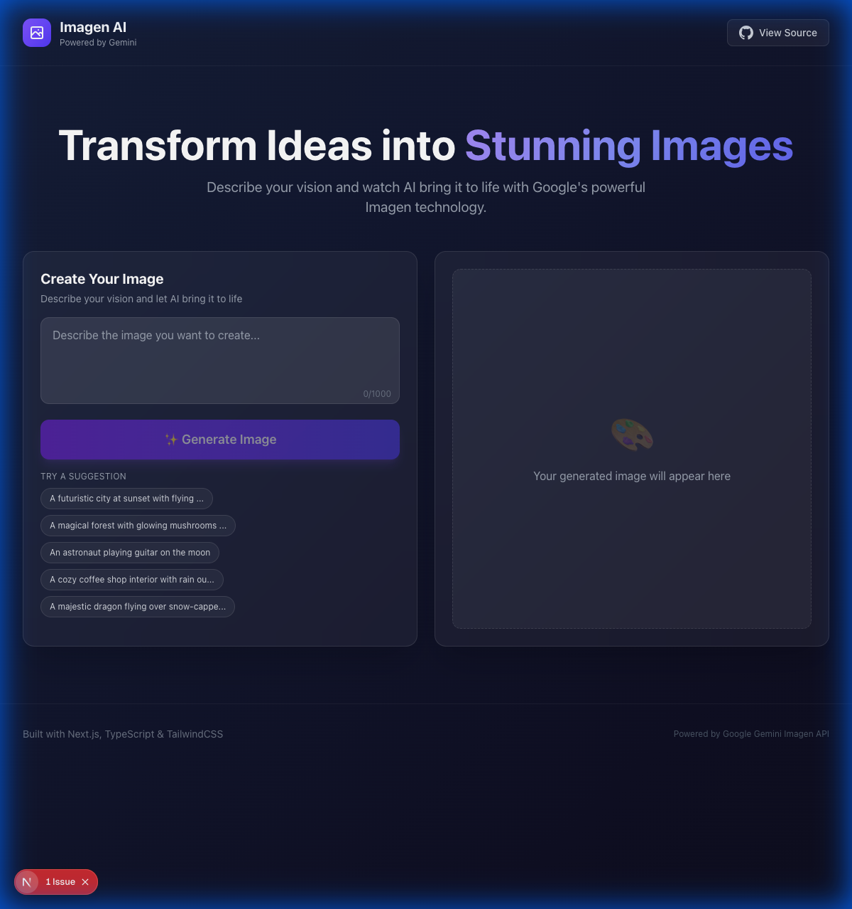

# AI Image Generator

> Transform your ideas into stunning images with AI

A modern web application that generates images from text prompts using Google's Gemini Imagen API. Built with Next.js 14, TypeScript, and TailwindCSS following clean architecture principles.



## ✨ Features

- **AI-Powered Generation** - Generate high-quality images from text descriptions using Google Gemini Imagen
- **Modern UI** - Beautiful dark theme with glassmorphism effects and smooth animations
- **Image History** - Recent generations saved locally for easy access
- **Download Support** - One-click download of generated images
- **Prompt Suggestions** - Quick-start with pre-built creative prompts
- **Responsive Design** - Works seamlessly on desktop, tablet, and mobile

## 🛠️ Tech Stack

- **Framework**: Next.js 14 (App Router)
- **Language**: TypeScript
- **Styling**: TailwindCSS
- **AI API**: Google Gemini Imagen 4
- **Deployment**: Vercel

## 📁 Project Structure

```
src/
├── app/                          # Next.js App Router
│   ├── api/generate/route.ts     # API endpoint
│   ├── layout.tsx                # Root layout with SEO
│   ├── page.tsx                  # Home page
│   └── globals.css               # Global styles
├── components/
│   ├── ui/                       # Reusable UI components
│   │   ├── Button.tsx
│   │   ├── Card.tsx
│   │   └── Spinner.tsx
│   └── features/ImageGenerator/  # Feature components
│       ├── index.tsx
│       ├── PromptInput.tsx
│       ├── ImageDisplay.tsx
│       └── ImageHistory.tsx
├── hooks/
│   └── useImageGeneration.ts     # Custom React hook
├── services/
│   └── imageGeneration.ts        # Business logic layer
├── lib/
│   └── gemini.ts                 # Gemini API adapter
├── types/
│   └── image.ts                  # TypeScript interfaces
└── utils/
    ├── validation.ts             # Input validation
    └── storage.ts                # localStorage helpers
```

## 🏗️ Architecture

This project follows **Clean Architecture** and **SOLID principles**:

- **Presentation Layer**: React components, pages, and hooks
- **Application Layer**: Services orchestrating business logic
- **Domain Layer**: TypeScript types and interfaces
- **Infrastructure Layer**: External API adapters (Gemini)

## 🚀 Getting Started

### Prerequisites

- Node.js 18+ 
- npm or yarn
- Google Cloud account with Gemini API access

### Installation

1. Clone the repository:
```bash
git clone <repository-url>
cd hyroscale-test-app
```

2. Install dependencies:
```bash
npm install
```

3. Set up environment variables:
```bash
cp .env.example .env.local
```

4. Add your Gemini API key to `.env.local`:
```
GEMINI_API_KEY=your_api_key_here
```

> **Note**: The Imagen API requires a billed Google Cloud account. See [Google AI documentation](https://ai.google.dev/gemini-api/docs/imagen) for details.

5. Start the development server:
```bash
npm run dev
```

6. Open [http://localhost:3000](http://localhost:3000) in your browser.

## 📦 Available Scripts

| Command | Description |
|---------|-------------|
| `npm run dev` | Start development server |
| `npm run build` | Build for production |
| `npm run start` | Start production server |
| `npm run lint` | Run ESLint |

## 🔧 Technical Decisions

### Why Next.js 14 with App Router?
- Server-side API routes for secure API key handling
- Built-in TypeScript support
- Excellent performance with automatic optimizations
- Seamless Vercel deployment

### Why TailwindCSS?
- Rapid UI development with utility classes
- Consistent design system
- Small bundle size with purging
- Great developer experience

### Why Clean Architecture?
- Separation of concerns for maintainability
- Easy to test individual layers
- Flexible to swap implementations (e.g., different AI providers)
- Clear dependency direction

## 🌐 Deployment

### Deploy to Vercel

1. Push your code to GitHub
2. Import the repository in [Vercel](https://vercel.com)
3. Add environment variable `GEMINI_API_KEY`
4. Deploy!

## 📄 License

MIT License - feel free to use this project for learning or commercial purposes.

---

Built with ❤️ for HYROSCALE
